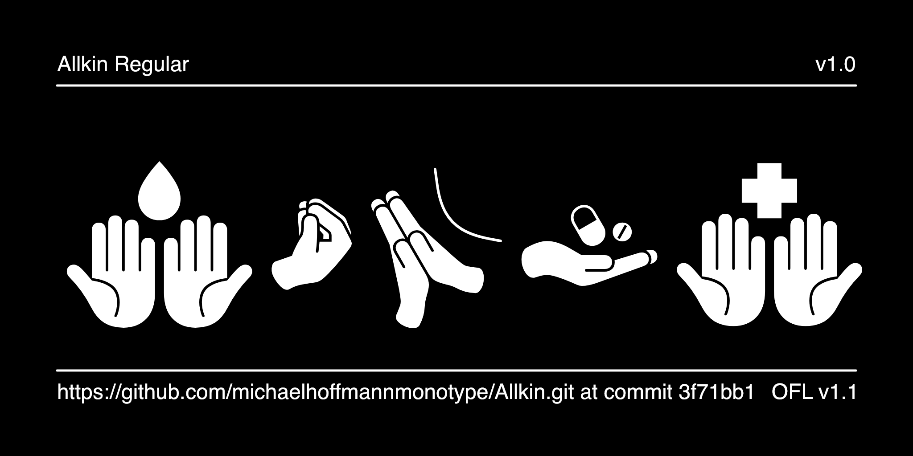
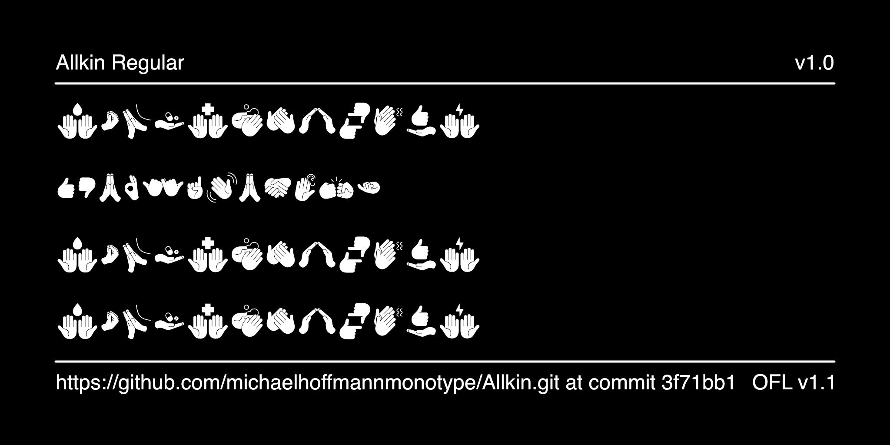

# Allkin

Allkin is a collection of 195 icons and 1 master symbol, which explores the power of design in times of peace and conflict. Whether on the front lines or far removed, users of Allkin can contribute meaningfully through symbolic gestures, expressing thoughts and messages for peace that cross cultural and language barriers.

## About

Monotype Imaging Inc. is a leader in the field of type design and technology across the globe. Monotype specializes in the design, development, licensing, and management of typefaces and font technologies for creative professionals and businesses.

## License

This Font Software is licensed under the SIL Open Font License, Version 1.1.
This license is available with a FAQ at https://openfontlicense.org

## Repository Layout

This font repository structure is inspired by [Unified Font Repository v0.3](https://github.com/unified-font-repository/Unified-Font-Repository), modified for the Google Fonts workflow.
